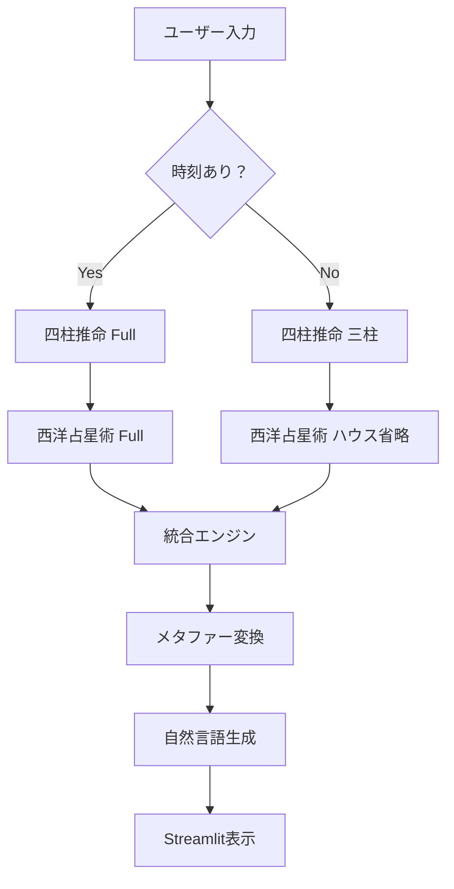

# PRD: 暦 KOYOMI - 多層占術統合システム

**作成日**: 2026年2月12日  
**バージョン**: 1.0  
**ステータス**: Draft

---

## 1. プロダクト概要

### 1.1 ビジョン
東洋・西洋の占術を統合し、「運命の選択」をサポートする意思決定支援システム

### 1.2 哲学
- 運命 = 命の運び（決定論ではなく、選択と行動）
- 依存ではなく、自立のお手伝い
- 足元を照らし、意思決定をサポート

---

## 2. 技術要件

### 2.1 必須要件

#### Layer 1: 四柱推命（泰山流調候用神）
- **入力**: 生年月日時（時刻は任意）
- **処理**:
  - 年柱: 立春基準
  - 月柱: 節入り基準
  - 日柱: 万年暦計算
  - 時柱: 時刻から算出（時刻不明時は省略）
  - 用神: 日干 × 季節 × 寒暖湿燥 → 120通り
- **出力**: 命式 + 用神リスト
- **制約**: 時刻不明時は「三柱推命モード」

#### Layer 2: 西洋占星術（出生図 + アスペクト）
- **入力**: 生年月日時 + 出生地（緯度経度）
- **処理**:
  - 天体位置計算（太陽〜冥王星）
  - ハウス計算（Placidus式）← 時刻不明時は省略
  - アスペクト判定（メジャー5種）
  - エレメント/モダリティ分析
- **出力**: 出生図データ + アスペクトリスト
- **制約**: 時刻不明時はハウス省略、太陽星座のみ表示

#### Layer 3: 易経（卦生成と解釈）
- **入力**: 生年月日 or ユーザー質問
- **処理**:
  - 本卦生成（数値変換法）
  - 変卦判定
  - 爻辞・卦辞取得
- **出力**: 本卦 + 変卦 + 解釈テキスト
- **制約**: 将来実装（Phase 2）

#### Layer 4: 紫微斗数（命盤作成）
- **入力**: 生年月日時（時刻必須）
- **処理**:
  - 命宮位置計算
  - 主星配置（紫微・天機・太陽等）
  - 12宮判定
- **出力**: 命盤データ
- **制約**: 
  - 時刻不明時はエラー（計算不可）
  - 将来実装（Phase 3）

#### 統合レイヤー: 自然言語統合
- **入力**: Layer 1-4 の全結果
- **処理**:
  - メタファー辞書による意味変換
  - 矛盾検出と調整
  - 自然言語生成
- **出力**: 統合鑑定テキスト
- **制約**: Phase 1では四柱推命のみ

---

### 2.2 技術制約

| 項目 | 制約 |
|------|------|
| **API費用** | 0円（外部API不使用） |
| **言語** | Python 3.10+ |
| **UI** | Streamlit |
| **データベース** | JSON（将来的にSQLite検討） |
| **天文計算** | pyephem / skyfield |
| **テスト** | pytest + pytest-cov |

---

## 3. 論理的矛盾の検証

### 3.1 矛盾1: 時刻不明時の扱いの不一致

**問題**:
- 四柱推命: 時刻不明でも三柱モードで計算可能
- 西洋占星術: ハウスが計算できない（精度低下）
- 紫微斗数: 計算完全不可

**回避策**:
```python
class BirthData:
    def __init__(self, dt: datetime, has_time: bool, location: tuple = None):
        self.datetime = dt
        self.has_time = has_time
        self.location = location  # (lat, lng)
    
    def can_calculate(self, layer: str) -> bool:
        """各レイヤーが計算可能か判定"""
        if layer == "shichusuimei":
            return True  # 常に可能
        elif layer == "astrology":
            return True  # ハウス省略で可能
        elif layer == "shibi":
            return self.has_time  # 時刻必須
        return False
```

### 3.2 矛盾2: 座標系の不一致

**問題**:
- 四柱推命: 中国標準時（UTC+8）基準
- 西洋占星術: 出生地のローカル時刻

**回避策**:
```python
# 全レイヤーでUTCに統一してから計算
import pytz

def normalize_datetime(dt: datetime, timezone_str: str) -> datetime:
    """タイムゾーンを考慮してUTCに変換"""
    tz = pytz.timezone(timezone_str)
    localized = tz.localize(dt)
    return localized.astimezone(pytz.UTC)
```

### 3.3 矛盾3: 解釈の優先順位

**問題**:
- 四柱推命で「木が用神」
- 西洋占星術で「火のエレメント過多」
- どちらを優先？

**回避策**:
```python
class IntegrationEngine:
    def resolve_conflicts(self, results: dict) -> dict:
        """矛盾を検出し、優先順位付け"""
        priority = ["shichusuimei", "astrology", "ekikyo", "shibi"]
        
        # 重み付け統合
        weighted_results = {}
        for i, layer in enumerate(priority):
            if layer in results:
                weighted_results[layer] = {
                    "data": results[layer],
                    "weight": 1.0 / (i + 1)  # 上位ほど重い
                }
        
        return weighted_results
```

---

## 4. アーキテクチャ設計

### 4.1 ディレクトリ構造

```
koyomi/
├── src/
│   └── koyomi/
│       ├── __init__.py
│       ├── core/              # 共通ロジック
│       │   ├── __init__.py
│       │   ├── birth_data.py  # 生年月日データクラス
│       │   └── constants.py   # 定数定義
│       ├── layer1/            # 四柱推命
│       │   ├── __init__.py
│       │   ├── engine.py
│       │   └── taizan_db.json
│       ├── layer2/            # 西洋占星術
│       │   ├── __init__.py
│       │   ├── engine.py
│       │   └── aspects.py
│       ├── layer3/            # 易経（将来）
│       ├── layer4/            # 紫微斗数（将来）
│       └── integration/       # 統合レイヤー
│           ├── __init__.py
│           └── engine.py
├── tests/
│   ├── unit/                 # 単体テスト
│   │   ├── test_layer1.py
│   │   ├── test_layer2.py
│   │   └── test_integration.py
│   └── integration/          # 統合テスト
│       └── test_e2e.py
├── docs/
│   ├── PRD.md               # このファイル
│   ├── ARCHITECTURE.md
│   └── API.md
├── app.py                   # Streamlit UI
├── requirements.txt
├── pytest.ini
└── README.md
```

---

## 5. データフロー



---

## 6. テスト方針

### 6.1 TDD原則
- **Red**: まずテストを書く（失敗する）
- **Green**: 最小限の実装で通す
- **Refactor**: コードを改善

### 6.2 カバレッジ目標
- 単体テスト: 80%以上
- 統合テスト: 主要パスを全てカバー

### 6.3 テストケース例

#### Layer1（四柱推命）
```python
def test_meishiki_with_time():
    """時刻ありの命式計算が正しいか"""
    dt = datetime(1990, 6, 15, 10, 30)
    result = layer1_engine.calculate(dt, has_time=True)
    
    assert result["day"]["kan"] == "丁"
    assert result["day"]["shi"] == "巳"
    assert "甲" in result["yojin"]

def test_meishiki_without_time():
    """時刻なしで三柱モードになるか"""
    dt = datetime(1990, 6, 15)
    result = layer1_engine.calculate(dt, has_time=False)
    
    assert result["hour"] is None
    assert result["mode"] == "sanchu"
```

#### Layer2（西洋占星術）
```python
def test_chart_with_time():
    """時刻ありで12ハウス計算されるか"""
    dt = datetime(1990, 6, 15, 10, 30)
    location = (35.6762, 139.6503)  # Tokyo
    result = layer2_engine.calculate(dt, location, has_time=True)
    
    assert len(result["houses"]) == 12
    assert result["sun"]["sign"] == "Gemini"

def test_chart_without_time():
    """時刻なしでハウス省略されるか"""
    dt = datetime(1990, 6, 15)
    location = (35.6762, 139.6503)
    result = layer2_engine.calculate(dt, location, has_time=False)
    
    assert result["houses"] is None
    assert result["sun"]["sign"] == "Gemini"
```

---

## 7. エラーハンドリング戦略

### 7.1 エラー階層

```python
class KoyomiError(Exception):
    """基底例外"""
    pass

class InvalidBirthDataError(KoyomiError):
    """不正な生年月日"""
    pass

class CalculationError(KoyomiError):
    """計算エラー"""
    pass

class LayerNotAvailableError(KoyomiError):
    """レイヤーが利用不可（時刻不明等）"""
    pass
```

### 7.2 エラーレスポンス

```python
{
    "success": False,
    "error": {
        "type": "InvalidBirthDataError",
        "message": "生年月日が1900年以前です",
        "suggestion": "1900年以降の日付を入力してください"
    }
}
```

---

## 8. 実装フェーズ

### Phase 1: MVP（現在）
- ✅ Layer1（四柱推命）完成
- ⬜ Layer1 テストコード
- ⬜ Streamlit UI改善

### Phase 2: 西洋占星術追加
- ⬜ Layer2 実装
- ⬜ Layer1 + Layer2 統合
- ⬜ 統合テスト

### Phase 3: 易経・紫微斗数
- ⬜ Layer3, Layer4 実装
- ⬜ 完全統合

### Phase 4: 自然言語化
- ⬜ メタファー辞書
- ⬜ LLM連携（オプション）

---

## 9. 成功指標

| 指標 | 目標値 |
|------|--------|
| テストカバレッジ | 80%以上 |
| レスポンス時間 | 鑑定結果 < 2秒 |
| ユーザー満足度 | NPS > 50 |
| エラー率 | < 1% |

---

## 10. 付録

### 10.1 参考資料
- 四柱推命: 泰山流調候用神理論
- 西洋占星術: Placidus House System
- pytest公式ドキュメント

### 10.2 用語集
- **用神**: 命式のバランスを整える五行
- **アスペクト**: 天体間の角度関係
- **三柱推命**: 時柱を省略した四柱推命
